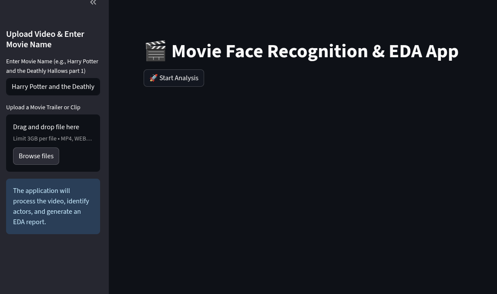
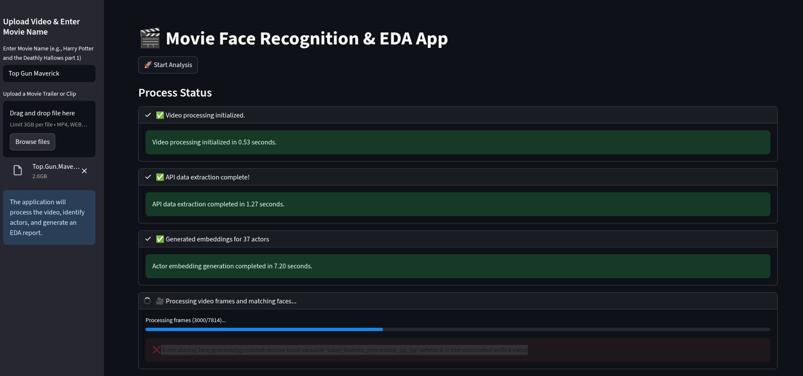
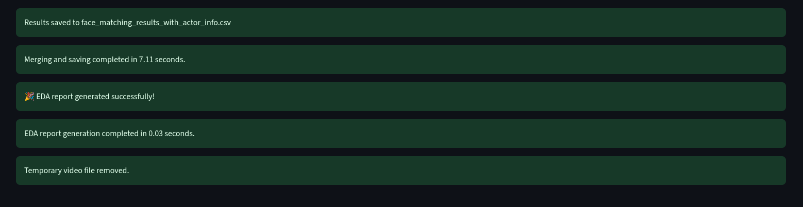
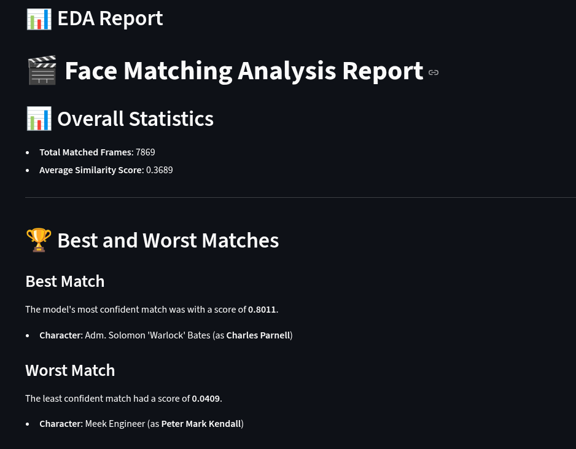
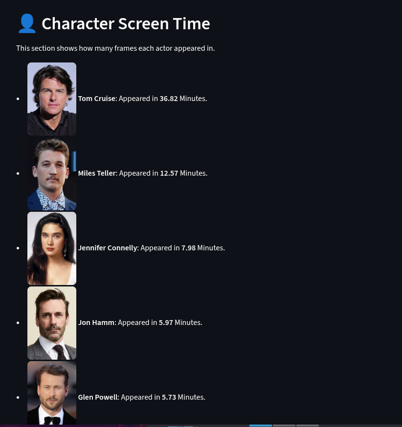
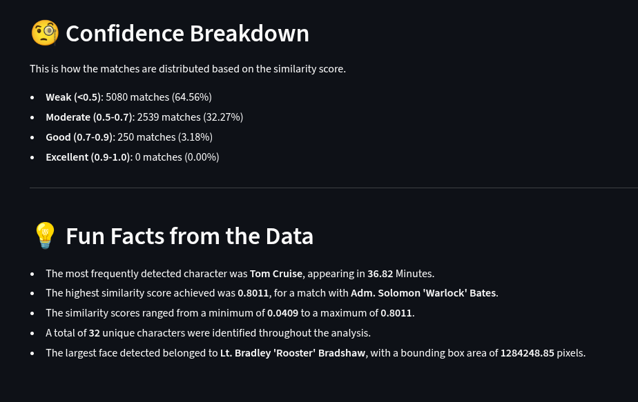

# Face Recognition in Movies using Deep Learning and Streamlit

This project is an interactive web application built with **Streamlit** that applies **deep learning-based face recognition** to analyze videos and identify actors.  

By uploading a movie clip or trailer, the system processes the video and generates a comprehensive **Exploratory Data Analysis (EDA) report**.  

The report includes insights such as:  
- Total screen time per actor  
- Best and worst face matches  
- Actor appearance breakdown across the video  
- Confidence scores and additional participation statistics  

---

## 🚀 Technologies Used

The project leverages a combination of libraries and frameworks for video processing, face recognition, and data analysis:

- **Python** — Core programming language  
- **Streamlit** — Interactive web application framework  
- **TMDb API** — Fetching movie and actor metadata  
- **PyTorch** — Neural network backend for embedding models  
- **InsightFace (ArcFace, PyTorch)** — Face recognition and embedding extraction  
- **OpenCV (cv2)** — Frame processing and image manipulation  
- **Pandas** — Data analysis and manipulation  
- **FFmpeg** — External tool for video conversion and processing  

---

## ⚙️ Prerequisites

You must configure your **TMDb API key** as an environment variable.  
Create a `.env` file at the root of the project with the following content:

```env
HEADER="Bearer YOUR_AUTHORIZATION_TOKEN_HERE"
```

> **Important:** Make sure your token value starts with `Bearer`.

---

## ▶️ Running the Project

To start the application, run:

```bash
streamlit run app.py --server.maxUploadSize 3000
```

The argument `--server.maxUploadSize 3000` allows uploads of files up to **3 GB**, which is ideal for high-resolution or long-duration videos.

---

## 📸 Example Screenshots

1. **Landing Page (App Homepage)**  
   {: width="800px"}

2. **Processing Steps**  
   {: width="800px"}
   {: width="800px"}

3. **EDA Report Overview**  
   Example generated using the movie *Top Gun: Maverick*.  

   The EDA (Exploratory Data Analysis) report provides a detailed breakdown of actor appearances throughout the video. It includes:  
   - Actor detection results with names and face matches  
   - Screen time distribution per actor  
   - Confidence scores for face recognition  

   {: width="800px"}
   {: width="800px"}
   {: width="800px"}

---

## 🔮 Future Improvements

Some possible areas for enhancement include:  

- Gathering more images per actor to improve the quality of the embeddings.  
- Leveraging frames extracted directly from the analyzed movie to update embeddings, increasing confidence in actor recognition.  
- Optimizing video preprocessing for faster analysis on longer clips.  
- Expanding support for additional face analysis tasks (e.g., expression or age estimation).  

---
